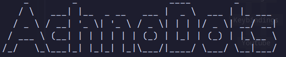
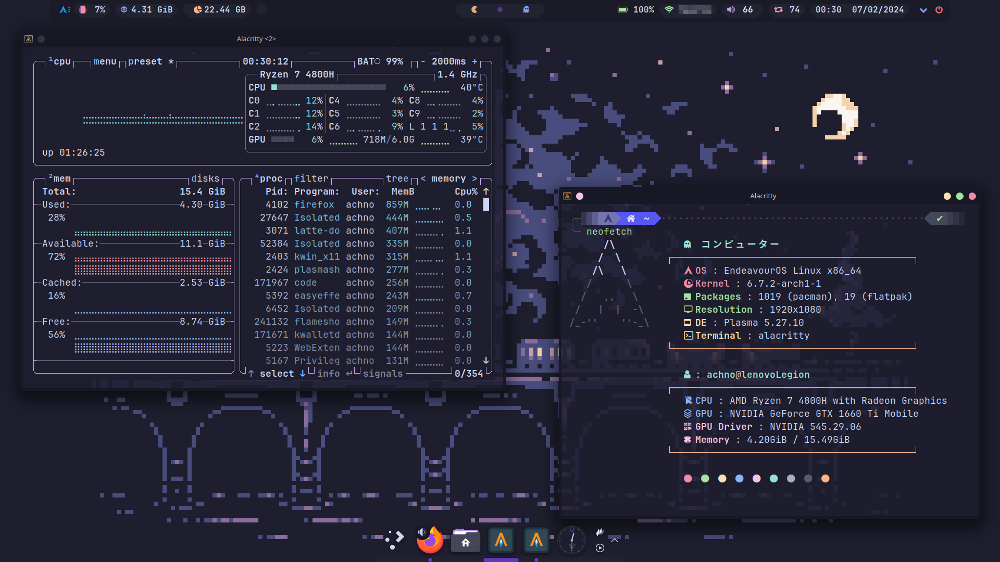

###### *
Design By Achno
*

  

&ensp;[<kbd>   Install   </kbd>](#Installation)&ensp;
&ensp;[<kbd>   Themes   </kbd>](#Themes)&ensp;
&ensp;[<kbd>   Packages   </kbd>](#Packages)&ensp;
&ensp;[<kbd>   Settings   </kbd>](#Youtube)&ensp;
    

  

   

## Installation ⚙️

 

The installation script will be made for Arch, I would advice against running it without checking it out first.

> CAUTION ⚠️
> The script installs a lot of applications which can be found in `pkglist.txt`.
> It also modifies your KDE settings , installs env's and a lot more, give everything a thorough read before using the script. 
> 

> IMPORTANT 🛑
> Currently the script will be only for X11 , Wayland is not currently planned but im sure i will get to that in the future when Nvidia plays nice with Wayland

 

## Themes 🎨

 

Currently the only supported theme is **Catppuccin** : Mocha Yellow  🌿

You can find more flavors [here](https://github.com/catppuccin/kde)

 

## Settings 🔨

 

> 🎯 Note
>Inside the settings folder are numerous fixes that are tailored for my laptop

## Packages 📜 

 

<table><tr><td>
<code>d</code> <code>e</code> <code>p</code> <code>e</code> <code>n</code> <code>d</code> <code>e</code> <code>n</code> <code>c</code> <code>y</code></td><td><table>
    <tr><td>latte-dock</td><td>A dock intergrated with KDE</td></tr>
    <tr><td>rofi</td><td>An application launcher</td></tr>
    <tr><td>Alacritty</td><td>The fastest GPU accelerated Terminal</td></tr>
    <tr><td>polybar</td><td>The bar on the top</td></tr>
    <tr><td>Neovim</td><td>Text editor</td></tr>
    <tr><td>VScode</td><td>IDE</td></tr>
    <tr><td>Easyeffects</td><td>Essential audio enhancer ( equalizer )</td></tr>
    <tr><td>Firefox</td><td>Web browser</td></tr>
    <tr><td>Dolphin</td><td>File manager</td></tr>
</td></tr></table>

 

